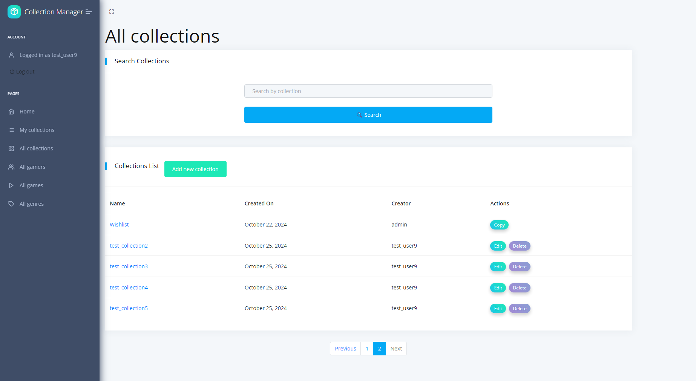

# Game Collection Manager

## Project Overview
Game Collection Manager is a web-based application designed for game enthusiasts who want to organize, expand, and share their game collections. With this platform, users can easily manage their games, explore collections from others, and discover new titles.

## Installation

```shell
git clone https://github.com/Morphin20th/Game-Collection-Manager
cd Game_Collection_Manager
python3 -m venv venv
source venv/bin/activate
pip install -r requirements.txt
python manage.py runserver
```

## Features
- **Create Game Collections**: Users can build and manage their own collections of games.
- **Copy Collections**: If a user finds a collection they like, they can duplicate it to add to their own library.
- **Visit User Profiles**: Users can explore profiles of others to see their collections and interests.
- **Database Management**: Users can add games and genres to the shared database.
- **Search Functionality**: Easily search for games, collections, genres, or users by title, collection name, genre, or username.
- **Filter Games by Genre**: Filter the list of games based on genre for quick discovery of titles in specific categories.


## Demo
https://game-collection-manager.onrender.com


## Login
Username:
test
Password:
Test1234!
